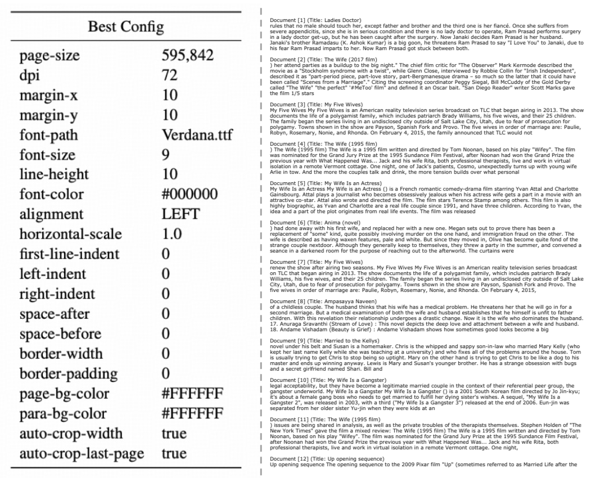
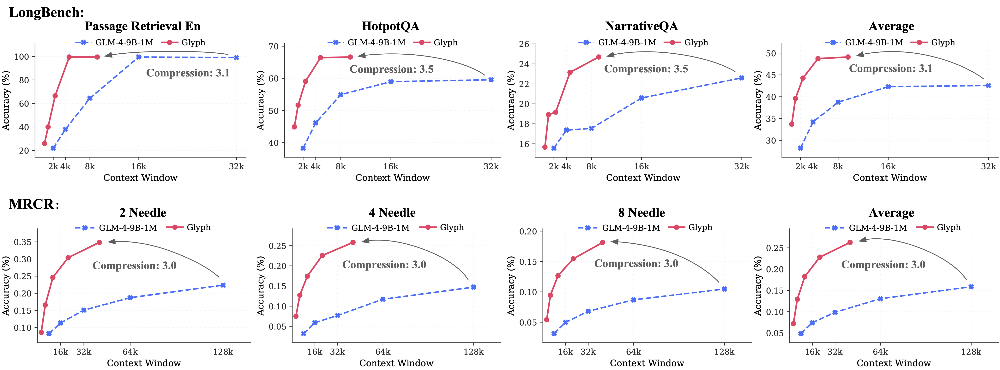

<h1>Glyph: Scaling Context Windows via Visual-Text Compression</h1>

<div align="center">
    <a href="https://huggingface.co/zai-org/Glyph/">🤗 Model</a> •
    <a href="https://arxiv.org/abs/2510.17800">📄 Paper</a> 
    • <a href="#demo">🌐 Demo</a>
</div>

<br>

**Glyph** is a framework for scaling the context length through visual-text compression.
Instead of extending token-based context windows, Glyph renders long textual sequences into images and processes them using vision–language models (VLMs).
This design transforms the challenge of long-context modeling into a multimodal problem, substantially reducing computational and memory costs while preserving semantic information.

<p align="center">
  
</p>

<p>
(Upper) Comparison of two paradigms for long-context tasks: conventional approaches directly feeding plain text into LLMs, and the proposed VLM-based paradigm, Glyph, which renders text as compact images to achieve substantial input-token compression. (Lower) Glyph attains competitive performance on LongBench and MRCR, while offering significant compression and inference speedup over its text backbone model on 128K-token inputs.
</p>


## Table of Contents
- [Table of Contents](#table-of-contents)
- [Demo](#demo)
- [Model](#model)
- [Quick Start](#quick-start)
  - [Setup](#setup)
  - [Rendering Config](#rendering-config)
  - [Image Rendering](#image-rendering)
- [Model Deployment (vLLM Acceleration)](#model-deployment-vllm-acceleration)
  - [Model Inference](#model-inference)
- [Evaluation](#evaluation)
- [Result](#result)
  - [Visual-Text Compression.](#visual-text-compression)
  - [Speedup ratios of Glyph](#speedup-ratios-of-glyph)
- [Known Limitations](#known-limitations)
- [Citation](#citation)

## Demo
We provide a ready-to-run demo script that deploys both a baseline text model (Qwen3/GLM4 etc.) and **Glyph**, enabling comparison of long-context inference efficiency.

After downloading the model, to see a side-by-side comparison of the output from Qwen3 and Glyph, run:
```bash
cd demo
bash run_demo_compared.sh
```

This demo will:

* Start a text-only LLM
* Start **Glyph** with visual–text compression
* Provide a simple testing interface for long-context question answering

If you wish to view only the output from Glyph, run the following command in the demo directory:
```bash
bash run_demo.sh
```

🎬 A short demonstration is provided below, showing the faster prefill speed of Glyph on long-context inputs:

https://github.com/user-attachments/assets/9317c567-2b25-40c0-a4f3-7c8edd7a4387

Glyph achieves notably improved prefill efficiency on long-context inputs, with increasing benefits as the sequence length grows. 🚀


## Model
Our model is built on `GLM-4.1V-9B-Base`. The fine-tuned model is publicly available on [Hugging Face](https://huggingface.co/zai-org/Glyph/). 
Welcome to download and use it!

The continual pre-training data of Glyph will be added to the new version of GLM-4.1V-9B-Base and will be released later.

## Quick Start

### Setup
First, please install the required dependencies using the following command:
```bash
apt-get install poppler-utils
pip install transformers==4.57.1 
# Optional
pip install vllm==0.10.2 sglang==0.5.2
```
Then, run the following code:

```python
from transformers import AutoProcessor, AutoModelForImageTextToText
import torch

messages = [
    {
        "role": "user",
        "content": [
            {
                "type": "image",
                "url": "https://raw.githubusercontent.com/thu-coai/Glyph/main/assets/Little_Red_Riding_Hood.png"
            },
            {
                "type": "text",
                "text": "Who pretended to be Little Red Riding Hood's grandmother"
            }
        ],
    }
]
processor = AutoProcessor.from_pretrained("zai-org/Glyph")
model = AutoModelForImageTextToText.from_pretrained(
    pretrained_model_name_or_path="zai-org/Glyph",
    torch_dtype=torch.bfloat16,
    device_map="auto",
)
inputs = processor.apply_chat_template(
    messages,
    tokenize=True,
    add_generation_prompt=True,
    return_dict=True,
    return_tensors="pt"
).to(model.device)
generated_ids = model.generate(**inputs, max_new_tokens=8192)
output_text = processor.decode(generated_ids[0][inputs["input_ids"].shape[1]:], skip_special_tokens=False)
print(output_text)
```

### Rendering Config
We provide the post-training configurations for both English and Chinese in the `config` directory, along with the corresponding fonts.

You can customize the newline behavior using the `newline-markup` option in the config file, which could affect the compression ratio:
-   Set `"newline-markup": "<font color=\"#FF0000\"> \\n </font>"` to use a special visual marker for newlines.
-   Set `"newline-markup": "<br/>"` for standard line breaks.

The compression ratio is also influenced by the DPI setting:
-   **DPI=72**: Achieving an average compression of 3-4x, which is the best trade-off between compression ratio and performance.
-   **DPI=96**: Achieving an average compression of 2-3x, which usually leads to better results than dpi 72.

A rendering example:




### Image Rendering
We provide scripts to render long text into images for your convenience.

This is a simple example of rendering a single text file (e.g., input.txt) into a sequence of images. You can adjust the rendering style by modifying `CONFIG_EN_PATH`.
```python
from test_word2png_function_fast import text_to_images

CONFIG_EN_PATH = '../config/config_en.json'
OUTPUT_DIR = './output_images'
INPUT_FILE = './input.txt'

# Read text from file
with open(INPUT_FILE, 'r', encoding='utf-8') as f:
    text = f.read()

# Convert text to images
images = text_to_images(
    text=text,
    output_dir=OUTPUT_DIR,
    config_path=CONFIG_EN_PATH,
    unique_id='test_001'
)

print(f"\nGenerated {len(images)} image(s):")
for img_path in images:
    print(f"  {img_path}")
```

**Note:** The current text rendering feature is implemented using the `reportlab` library. While the overall process is stable, there is still significant room for acceleration.

## Model Deployment (vLLM Acceleration)

Our model supports vLLM acceleration for inference, which significantly improves throughput and response speed in long-context scenarios. Use the following command to start the vLLM-served model:

```bash
vllm serve YOUR_MODEL_PATH --port 5002 --served-model-name glyph --allowed-local-media-path / --media-io-kwargs '{"video": {"num_frames": -1}}'
```

### Model Inference
After rendering the text into images, you can perform inference with the VLM.

```python
from vlm_inference import vlm_inference

response = vlm_inference(
    question="Based on the story in the figures, what is the ending of the wolf?",
    image_paths=["./output_images/Little_Red_Riding_Hood/page_001.png"]
)
print("VLM's Response:")
print(response)
```

## Evaluation

We provide evaluation scripts and test cases for benchmarks including LONGBENCH, MRCR, and RULER. For detailed instructions on running the evaluations, please refer to the guide in [evaluation/readme.md](./evaluation/readme.md).

## Result

### Visual-Text Compression.

Glyph achieves context window scaling, matching the performance of text LLMs that use 3×–4× longer contexts through visual–text compression.

### Speedup ratios of Glyph

Speedup ratios of Glyph over the text backbone model for prefill, decoding, and training across different sequence lengths.

## Known Limitations
- Sensitivity to rendering parameters: Glyph’s performance can vary with rendering settings such as resolution, font, and spacing. Since our search procedure adopts a fixed rendering configuration during post-training, the model may not generalize well to unseen or substantially different rendering styles.
- OCR-related challenges: Recognizing fine-grained or rare alphanumeric strings (e.g., UUIDs) remains difficult for visual-language models, especially with ultra-long inputs, sometimes leading to minor character misclassification.
- Limited generalization: The training of Glyph mainly targets long-context understanding, and its capability on broader tasks is yet to be studied.

## Citation
If you find our model or code useful in your research, please cite our paper:
```
@article{cheng2025glyphscalingcontextwindows,
    title={Glyph: Scaling Context Windows via Visual-Text Compression}, 
    author={Jiale Cheng and Yusen Liu and Xinyu Zhang and Yulin Fei and Wenyi Hong and Ruiliang Lyu and Weihan Wang and Zhe Su and Xiaotao Gu and Xiao Liu and Yushi Bai and Jie Tang and Hongning Wang and Minlie Huang},
    journal={arXiv preprint arXiv:2510.17800},
    year={2025}
}
```
