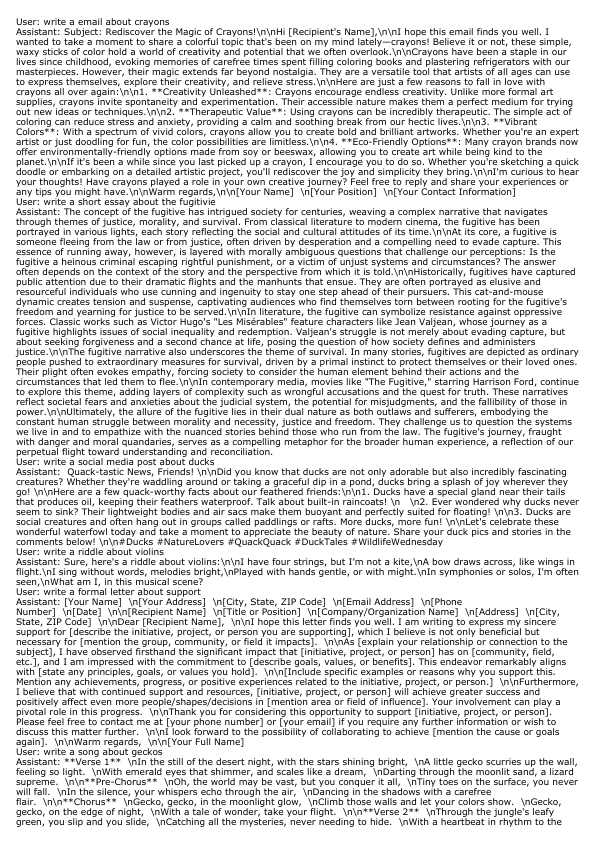

# Evaluation

We evaluate the performance of **Glyph** using the following three classic long-context language model benchmarks:
*   **[LongBench](https://huggingface.co/datasets/zai-org/LongBench)**
*   **[MRCR](https://huggingface.co/datasets/openai/mrcr)**
*   **[RULER](https://github.com/NVIDIA/RULER)**

Below, we detail our evaluation methodology for each benchmark.

## LongBench

For the LongBench benchmark, which comprises a diverse set of tasks requiring deep comprehension of long texts, we have designed a specific data processing workflow to accommodate Glyph's visual input.

**Format:**
To do this, we need to slightly modify the promt of longbench to make it more suitable for image input as ```./longbench/config/dataset2vlmprompt.json```

**Evaluation Steps:**
1.  **Data Preparation**: Please download the preprocessed [dataset](https://huggingface.co/datasets/CCCCCC/Glyph_Evaluation) and put it in the `./longbench/data/` directory.
2. **Text Rendering**:  Execute the following script to render the processed contexts into images.

    **Please note:** For alternative rendering configurations, you will need to modify the ```../config/config_en.json```  & ``` ../config/config_zh.json``` file.

    **New line:** By default, normal line breaks are used. You can choose ```--chose_newline```, which applies special line breaks to some of our recommended categories. This helps compress tokens as much as possible without significantly affecting results. Alternatively, you can use ```--all_newline``` to apply special line breaks to all categories..

    ```bash
    cd ./evaluation
    python ./longbench/scripts/add_uid_jsonl.py --chose_newline
    python ./longbench/scripts/word2png_longbench.py
    ```
3.  **Model Evaluation**: Once rendering is complete, run the evaluation script to obtain the results.
    ```bash
    python ./longbench/scripts/post_api_longbench.py --use_image
    python ./longbench/scripts/clear_pred.py ./longbench/pred/glyph ./longbench/results
    python ./longbench/scripts/eval_longbench.py
    ```
    The experimental results are shown in the file: ```./longbench/results/result.json```

    The token usage statistics are shown in the file: ```./longbench/results/token_stat.json```


## MRCR

For the MRCR benchmark, which involves processing long texts with multiple turns to answer questions, we have designed a specific data processing workflow to accommodate Glyph's visual input.

**Format:**

We keep the question as a text input, while the original context is combined with a `User:` , `Assistant:` identifier and then rendered into an image. The format of each turn is as follows:

```text
User: write a ...
Assistant: detailed content
```

An example of the rendered output is shown below:



**Evaluation Steps:**

1.  **Data Preparation**: Please download the processed MRCR [dataset](https://huggingface.co/datasets/CCCCCC/Glyph_Evaluation) and put it in the `./mrcr/data/` directory.
2.  **Text Rendering**: Run the following script to render the long-text contexts from the dataset into images.
    ```bash
    python ./mrcr/scripts/word2png_mrcr.py
    ```
3.  **Model Evaluation**: After rendering is complete, execute the following script to call the model API, perform the evaluation, and calculate the final scores.
    ```bash
    python ./mrcr/scripts/post_api_mrcr.py
    ```

## RULER

The RULER benchmark tests a model’s ability to perform needle-in-a-haystack retrieval.

**Format:**

We observed that rendering the few-shot examples together with the actual context into an image significantly interferes with the model's judgment, thereby affecting the accuracy of the evaluation results. 
Therefore, we **removed the few-shot example portions from the context**. Only the remaining core context is rendered into an image, while the questions and instructions are kept as text inputs.

**Evaluation Steps:**

1.  **Data Preparation**: Please download the preprocessed RULER [dataset](https://huggingface.co/datasets/CCCCCC/Glyph_Evaluation) and put it in the `./ruler/data` directory.
2.  **Text Rendering**: Execute the following script to render the processed contexts into images.
    ```bash
    cd ./evaluation
    python ./ruler/scripts/word2png_ruler.py
    ```
3.  **Model Evaluation**: Once rendering is complete, run the evaluation script to obtain the results.
    ```bash
    python ./ruler/scripts/post_api_ruler.py
    ```